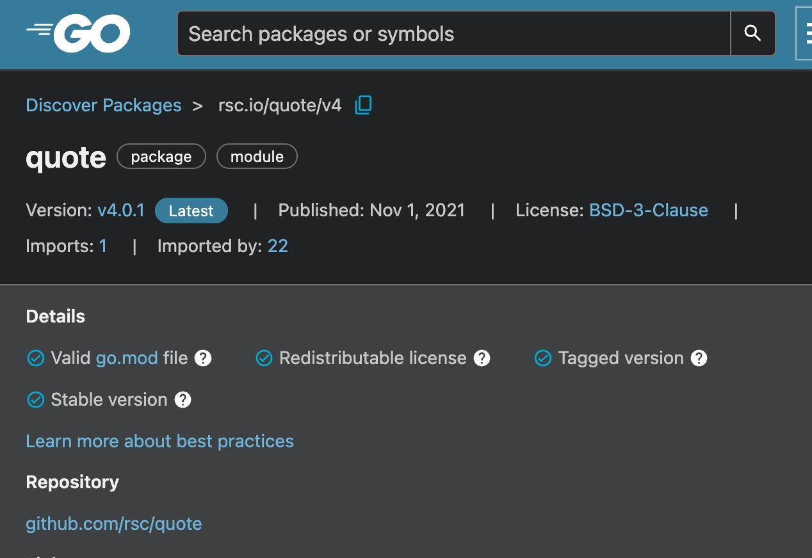

# Documentation

Source of this code: https://go.dev/doc/tutorial/getting-started

The `go.mod` stays with the code, in the repository. It tracks the dependencies of your project.

This file is created by using `go mod init` [command](https://go.dev/ref/mod#go-mod-init). This command takes as input a module path, which would typically be the path to your github repo.

For the purposes of this demo, we just use `go mod init example/hello`.

After writing the code in `hello.go`, we run our code using `go run .` in the `cwd`.

We make adaptations to our go file, this version is in the directory `quote`. 
The way to do this is to use `go mod tidy`, which will add the `quote` module as a requirement, but also update the `go.sum` for use in "authenticating" the module.

