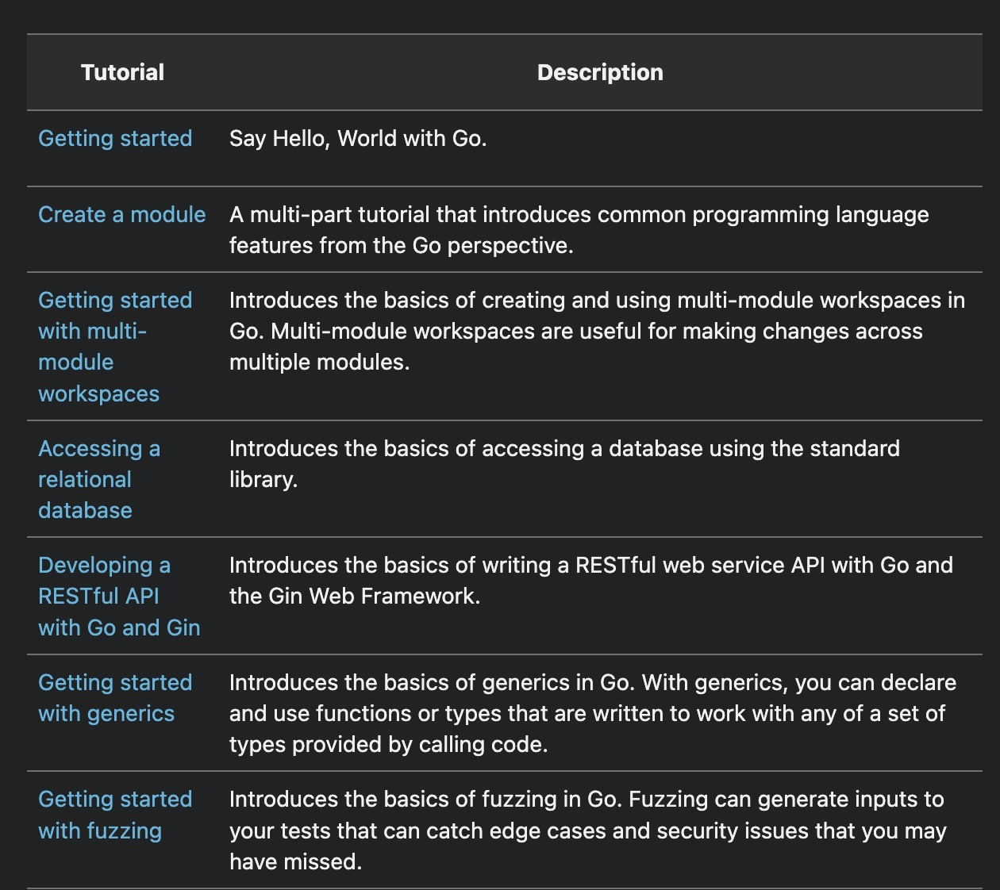

# golang-tutorials

This series is mostly following the tutorials in the list [here](https://go.dev/doc/tutorial/).

See below:

For each tutorial, I create a separate directory containing code related to it. Furthermore, I write a README.`me` for the relevant tid bits from the documentation.
